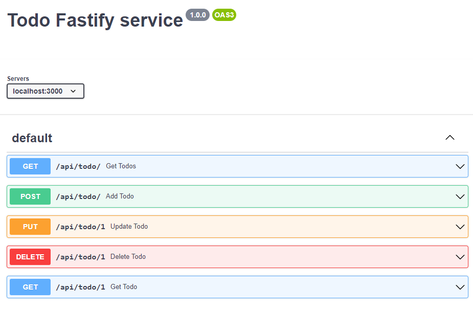

# todo-api backend service

> A super simple Fastify-powered backend to serve todo.

## Setup

* Install [`node >= 14`](https://nodejs.org/it/download/)
* Run `npm install` and `npm start` to bootstrap the server in `localhost:3000`
* OpenAPI specs: `[docs/Todo_fastify_service.openapi.yml](https://github.com/RBTech-dev/ng-intro/blob/main/todo-api/docs/Todo_fastify_service.openapi.yml)` ([live editor](https://raw.githubusercontent.com/RBTech-dev/ng-intro/main/todo-api/Todo_fastify_service.openapi.yml)
* [Postman](Postman) collection: `[docs/Todo_fastify_service.postman_collection.json](https://github.com/RBTech-dev/ng-intro/blob/main/todo-api/docs/Todo_fastify_service.postman_collection.json)`

## Some suggested improvements

* [ ] In real-world application, use JSON Schema in fastify routes to validate the incoming data
* [ ] Connect to a real database: you can use MongoDB via [fastify-mongodb](https://github.com/fastify/fastify-mongodb)
* [ ] Authentication: you can use [fastify-jwt](https://github.com/fastify/fastify-jwt)
* [ ] New endpoint to add a todo with unique `description`
* [ ] Paginate get all todo response
* [ ] Nested todo (todo contains other todo and mark as done the parent should mark every child)
* [ ] Multiple todo lists

## Fastify

### Getting Started with [Fastify-CLI](https://www.npmjs.com/package/fastify-cli)

This project was bootstrapped with Fastify-CLI.

### Available Scripts

In the project directory, you can run:

### `npm run dev`

To start the app in dev mode.\
Open [http://localhost:3000](http://localhost:3000) to view it in the browser.

#### `npm start`

For production mode

#### `npm run test`

Run the test cases.

### Learn More

To learn Fastify, check out the [Fastify documentation](https://www.fastify.io/docs/latest/).
