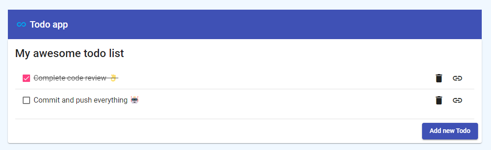

# todo-app angular app example



> A simple **PWA boosted** todo app used to add, mark as done and delete todos.

## Setup

* Install [`node >= 14`](https://nodejs.org/en/download/)
* Install ng CLI globally with `npm install -g @angular/cli` ([read more](https://angular.io/cli))
* Run `npm install` and `ng serve` to start the angular dev server in `localhost:4200`
* Run `todo-api` service ([read more](https://github.com/RBTech-dev/ng-intro/tree/main/todo-api/README.md))
* In `step-by-step-commands.md` there are ng CLI commands used to generate components, services and routes used by this application.

> Do not forget to run `todo-api` server!

## Start/debug Service Worker

`ng serve` does not work with service workers, so we have to use a separate HTTP server, like [http-server](https://www.npmjs.com/package/http-server) package from npm:

* Install [http-server](https://www.npmjs.com/package/http-server): `npm install -g http-server`
* Run `todo-api` service ([read more](https://github.com/RBTech-dev/ng-intro/tree/main/todo-api/README.md))
* Run `ng build` to produce the production build in `dist/todo-app`
* Run `ng serve` to serve `todo-app` in `localhost:4200` that we will use as proxy
* Run `http-server` with:

```shell
http-server -p 8080 -c-1 dist/todo-app --proxy http://localhost:4200 --proxy-options.secure false
```

* The server is live at `localhost:8080` with `todo-app` with service worker configured in `ngsw-config.json`.

## Some useful improvements

* [ ] Improve the UI using [Angular Material components](https://material.angular.io/components)
* [ ] Add authentication: you can create an [interceptor](https://angular.io/api/common/http/HttpInterceptor) to add a JWT Bearer token
* [ ] Nested todo (todo contains other todo and mark as done the parent should mark every child)
* [ ] Multiple todo lists
* [ ] Undo/Redo feature
* [ ] Use a state management system like [NgRx](https://ngrx.io/) to keep the state consistent
  * [ ] Show a loader when a request takes more than 400ms (for ex. using [material spinner](https://material.angular.io/components/progress-spinner/examples#progress-spinner-overview))

## Development server

Run `ng serve` for a dev server. Navigate to `http://localhost:4200/`. The application will automatically reload if you change any of the source files.

## Code scaffolding

Run `ng generate component component-name` to generate a new component. You can also use `ng generate directive|pipe|service|class|guard|interface|enum|module`.

## Build

Run `ng build` to build the project. The build artifacts will be stored in the `dist/` directory.

## Running unit tests

Run `ng test` to execute the unit tests via [Karma](https://karma-runner.github.io).

## Running end-to-end tests

Run `ng e2e` to execute the end-to-end tests via a platform of your choice. To use this command, you need to first add a package that implements end-to-end testing capabilities.
